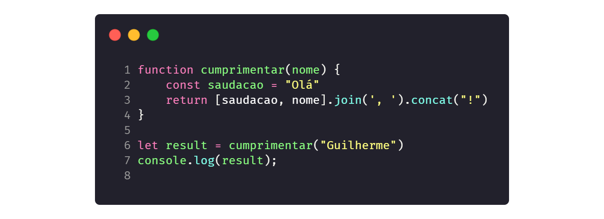

# Exercícios JS

1. Crie uma função que retorna a *string* "Olá", concatenada com um argumento *text* (a ser passado para a função) e com ponto de exclamação "!" no final.
    
    *Exemplos:*
    ```js
    cumprimentar("Guilherme") // retornará "Olá, Guilherme!"
    cumprimentar("Esdras") // retornará "Olá, Esdras!"
    ```
    <details closed>
    <summary><strong>Resolução</strong></summary>

    - <strong>Método 1:</strong> <br>
      <a href="./soluções/1/1.js"><a>
    
    - <strong>Método 2:</strong> <br>
      <a href="./soluções/1/1_v2.js"><a>
    
    - <strong>Método 3:</strong> <br>
      <a href="./soluções/1/1_v3.js"><a>
    
    - <strong>Método 4:</strong> <br>
      <a href="./soluções/1/1_v4.js"><a>
    
    </details>

2. Escreva uma função que receba a idade de uma pessoa em anos e retorna a mesma idade em dias.
    > Obs.: considere que um ano tem 365 dias. Desconsidere anos bissextos (com 366 dias) e desconsidere também dias decorridos desde o último aniversário.

    *Exemplos:*
    ```js
    converterIdadeEmAnosParaDias(25) // retornará 9125
    converterIdadeEmAnosParaDias(70) // retornará 9125
    ```

    <details closed>

    <summary><strong>Solução</strong></summary>

    <strong>Método 1:</strong>

    <a href="./soluções/2/2.js"><a>
    
    <strong>Método 2:</strong>

    <a href="./soluções/2/2_v2.js"><a>

    </details>
